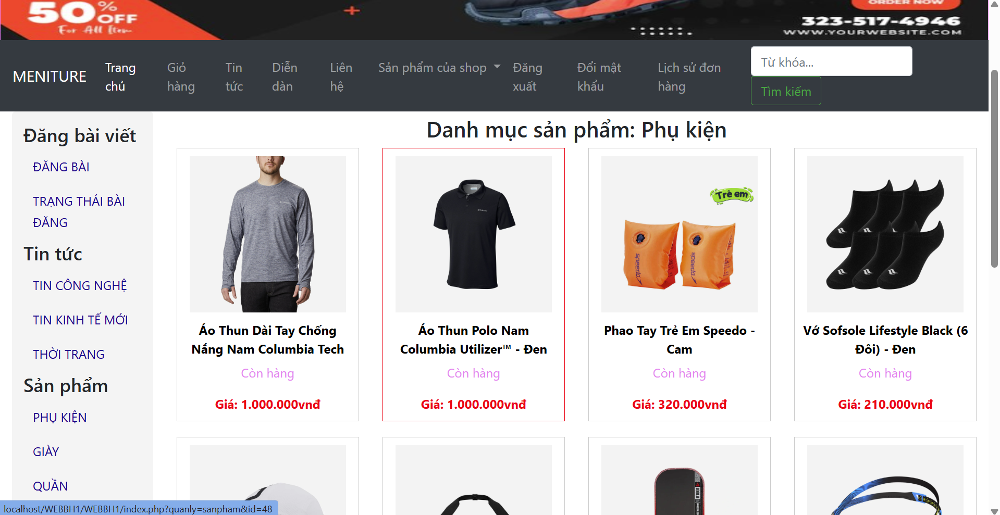
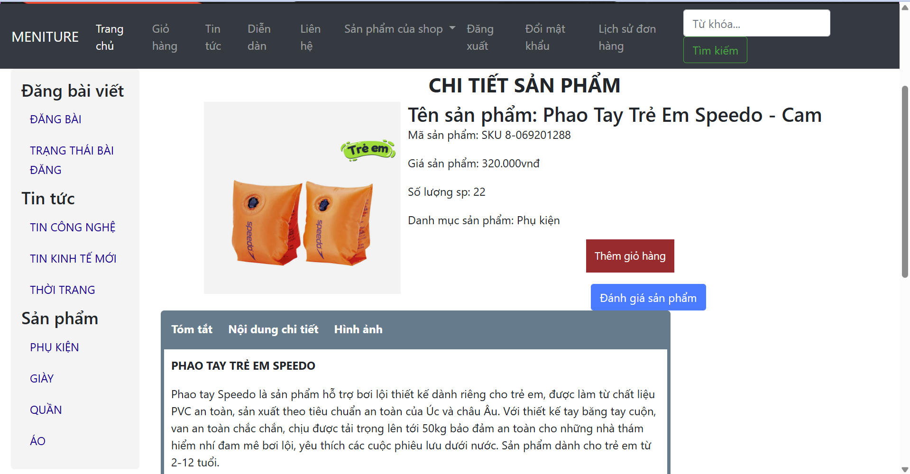
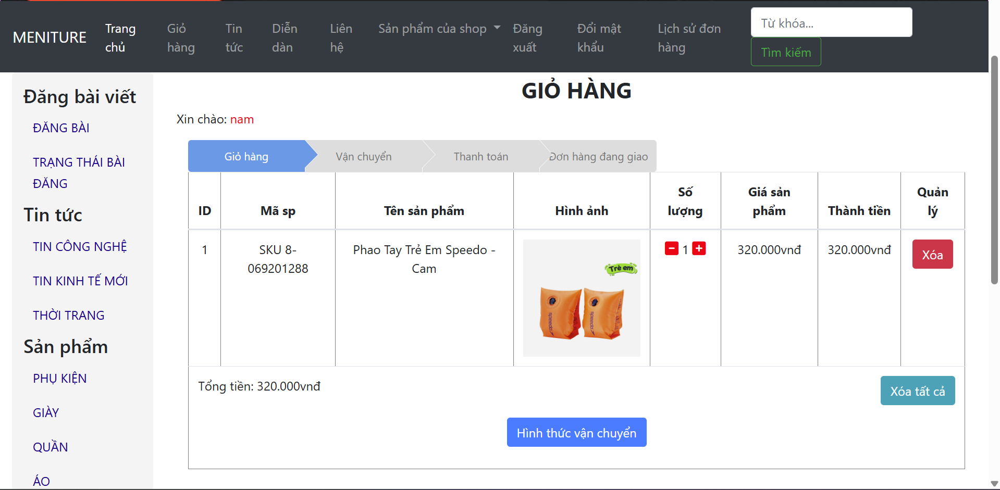

DAILY REPORT - 08/04/2026
Dự án: Xây dựng website bán sản phẩm kính mắt - Kochi Lens
Nhóm: Đỗ Hoàng Nam - 23810310303, Nguyễn Hồng Phong - 23810310433

1. Tổng hợp tiến độ hôm nay 08/04/2026
| Thành viên | Chức năng phụ trách | Trạng thái | Ghi chú (Nếu có) |
| :--- | :--- | :--- | :--- |
| Đỗ Hoàng Nam | Giai đoạn 4: Module sản phẩm (danh sách/chi tiết) | ✅ Hoàn thành | Đã tích hợp hiển thị dữ liệu sản phẩm theo danh mục |
| Nguyễn Hồng Phong | Giai đoạn 4: Danh mục + giỏ hàng | ✅ Hoàn thành | Đã xử lý thêm/xóa/cập nhật số lượng trong giỏ |

2. Task status (Giai đoạn 4)
| Task/User Story | Người phụ trách | Trạng thái | Ghi chú |
| :--- | :--- | :--- | :--- |
| US-4.1: Xem danh sách sản phẩm | Đỗ Hoàng Nam | ✅ Done | Có trang hiển thị danh sách sản phẩm |
| US-4.2: Xem sản phẩm theo danh mục | Đỗ Hoàng Nam | ✅ Done | Đã lọc theo danh mục |
| US-4.3: Xem chi tiết sản phẩm | Đỗ Hoàng Nam | ✅ Done | Đã hiển thị thông tin cơ bản của sản phẩm |
| US-4.4: Thêm sản phẩm vào giỏ hàng | Nguyễn Hồng Phong | ✅ Done | Đã xử lý thêm vào giỏ |
| US-4.5: Cập nhật/xóa sản phẩm trong giỏ | Nguyễn Hồng Phong | ✅ Done | Đã xử lý cập nhật số lượng và xóa |

3. Screenshot / Video minh chứng
3.1. Screenshot 1: Trang danh sách sản phẩm theo danh mục.

3.2. Screenshot 2: Trang chi tiết sản phẩm.

3.3. Screenshot 3: Trang giỏ hàng (thêm/cập nhật/xóa).

3.4. Video ngắn (nếu có): Demo luồng duyệt sản phẩm -> thêm giỏ hàng -> cập nhật giỏ hàng.
3.5. Gợi ý đặt file minh chứng trong repo: reports/assets/20260408/ và chèn link trực tiếp vào báo cáo.

4. Đánh giá tiến độ
Trong ngày 08/04/2026, nhóm đã triển khai xong các đầu việc chính của Giai đoạn 4 gồm: sản phẩm, danh mục và giỏ hàng. Các chức năng nền tảng đã chạy được trên local, đủ điều kiện chuyển sang Giai đoạn 5 (đặt hàng, thanh toán).

5. Kế hoạch tiếp theo (09/04/2026)
5.1. Bắt đầu Giai đoạn 5: xử lý đặt hàng và thanh toán.
5.2. Bổ sung test cho luồng giỏ hàng và chuyển bước checkout.
5.3. Hoàn thiện minh chứng (ảnh/video) và cập nhật link vào báo cáo.

